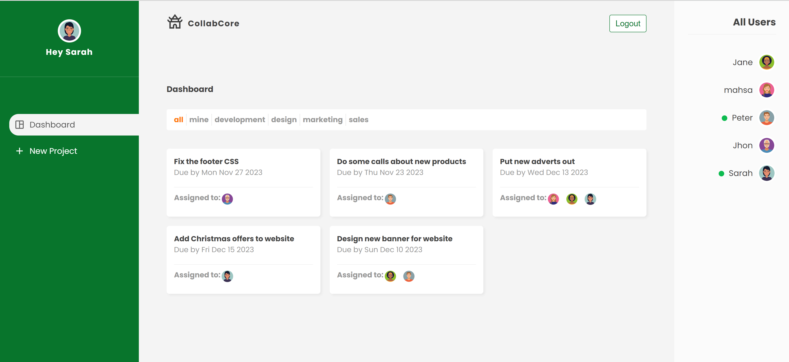
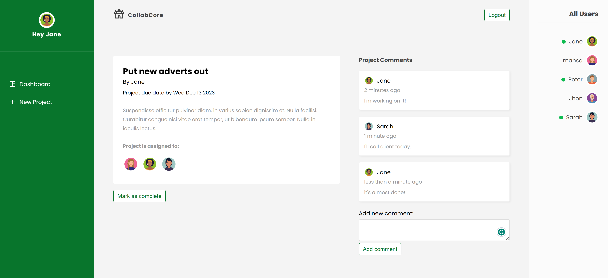

# CollabCore - Project Management Web App

CollabCore is a collaborative project management web application built to facilitate seamless project creation, task assignment, and communication among team members. It allows users to sign up, create projects, assign team members, track progress, and interact with other users in real-time. It also features user profiles, project commenting, and online user tracking for better collaboration.

## Features

- **User Authentication & Authorization**: Sign up, login, and access control using Firebase Authentication.
- **Project Creation**: Create and manage projects, including setting details such as project name, due date, and category.
- **Task Assignment**: Assign users to different projects and tasks for streamlined collaboration.
- **User Profiles**: Each user has a personalized profile with a thumbnail image and name displayed in the users section.
- **Comments on Projects**: Users can leave comments and feedback on different projects to foster collaboration.
- **Online User Tracking**: Displays all users currently online, promoting real-time communication.
- **Project Filtering**: A top navbar allows users to filter projects by category or view only those assigned to them.
- **Owner-exclusive Actions**: Only the creator of a project can mark it as completed or delete it, ensuring data integrity.

## Technologies

- **Frontend**: React, React Router
- **Backend/Authentication**: Firebase (Firestore, Firebase Auth)
- **Hosting**: Firebase Hosting
- **Realtime Database**: Firestore for managing projects, users, and real-time data
- **Storage**: Firebase Storage for user profile images

## Installation

To set up the project locally, follow these steps:

1. Clone the repository:
   ```bash
   git clone https://https://github.com/mpesaran/CollabCore.git
   cd collabcore
2. Install dependencies:
   ```
   npm install
3. Set up Firebase:
   - Create a Firebase project.

   - In your Firebase project, navigate to Project Settings and find your Firebase configuration.

   - Create a new file in the root of your project called .env and add your Firebase credentials as environment variables:
     ```
      REACT_APP_API_KEY=YOUR_API_KEY
      REACT_APP_AUTH_DOMAIN=YOUR_AUTH_DOMAIN
      REACT_APP_PROJECT_ID=YOUR_PROJECT_ID
      REACT_APP_STORAGE_BUCKET=YOUR_STORAGE_BUCKET
      REACT_APP_MESSAGING_SENDER_ID=YOUR_MESSAGING_SENDER_ID
      REACT_APP_APP_ID=YOUR_APP_ID

4. Run the app locally:
   ```
   npm start
 \
   This will start the app

## Firebase Rules
The project uses Firestore and Firebase Storage. Firestore rules are in place to ensure data security and integrity. Only authenticated users can interact with the database, and project data is protected from unauthorized access.

```
service cloud.firestore {
  match /databases/{database}/documents {
    match /projects/{projectId} {
      allow read, write: if request.auth != null && (resource.data.owner == request.auth.uid);
    }
  }
}
```
## Deployment
The project is deployed using Firebase Hosting. The deployment process involves uploading the build folder generated by React to Firebase Hosting.

To deploy:

1. Run the following command to build the React app:
   ```
   npm run build
   ```
2. Install Firebase CLI if you haven't already:
   ```
   npm install -g firebase-tools
   ```
3. Initialize Firebase in your project:
   ```
   firebase init
   ```
4. Deploy the app to Firebase:
   ```
   firebase deploy
   ```
## Screenshots
### Dashboard

### Project Details Page

### Filter Projects


## Contributing
Contributions are welcome! Feel free to fork the repository, report issues, or open pull requests.

## Author
Created by [Me](https://github.com/mpesaran)

If you have any questions or feedback, feel free to reach out through GitHub.